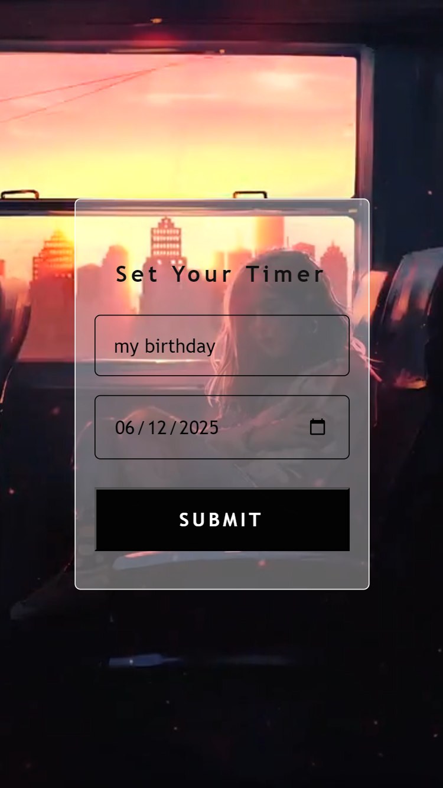
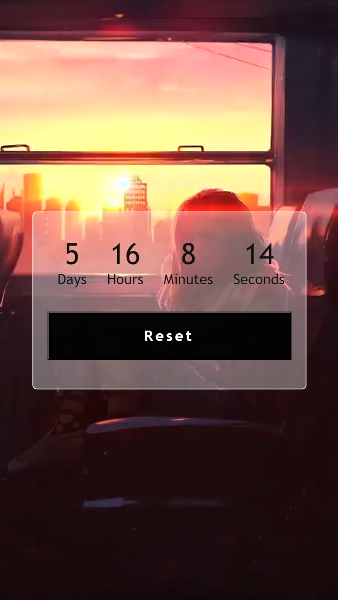

# Countdown Timer App

## Introduction

Welcome to Countdown Timer App

This repository contains the web app I coding along with a js course where we make 20 js projects and learn about different js concepts and web APIs by following along.
This is the 2nd project in this series.

- **Live Link:** [Link](https://mbilal-x.github.io/js-20__P2_custom-countdown)
- **Code Link:** [Link](https://github.com/mbilal-x/js-20__P2_custom-countdown)
- **Screen Shots:**
  
  
  

## Technologies Used

- HTML
- CSS
- JS

## Process

Things I practiced:

- working with date object and methods
- calculating time in days hours minutes seconds
- deprecated DOM properties
- background position adjustment
- setInterval and clearInterval
- storing, accessing and clearing localStorage

## Motivation

To improve my skill and understanding of js by building projects alongside tutorials.

## Improvements

To further improve this project:

- instead of just date, time can only be taken into account
- LoFi BG music can be added
- A clock ticking sound effect (sfx) can be included
- design can be improved
- efficience in loading can be improved
